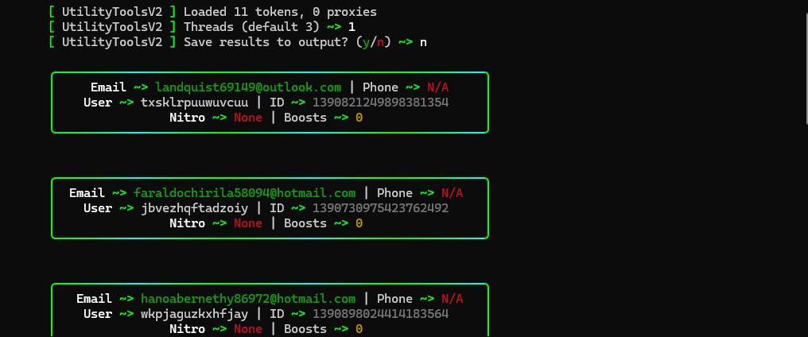

I've got you. To avoid the Markdown "box within a box" issue that breaks GitHub copy-pasting, I have structured this as a single, continuous block.

Save the following content as `README.md` in your project root.

-----

# \<p align="center"\>\\</p\>

\<h1 align="center"\>UtilityToolsV2 | Token Checker\</h1\>
\<p align="center"\>
\<b\>High-Performance Discord Token Validator & Data Extractor\</b\><br>
\<i\>Validate · Extract · Sort · Advanced TLS Fingerprinting\</i\>
\</p\>

\<p align="center"\>
\<a href="\#-features"\>Features\</a\> •
\<a href="\#-quick-start"\>Quick Start\</a\> •
\<a href="\#-output-structure"\>Output Structure\</a\> •
\<a href="\#-technical-specs"\>Technical Specs\</a\>
\</p\>

-----

## 🚀 Features

  - **Advanced TLS Bypassing** - Implements `tls_client` to mimic Chrome 120 and Firefox 117 fingerprints to evade detection.
  - **Cloudflare Integration** - Built-in `CFClearance` logic to handle `__cf_clearance` and `cf_bm` cookies automatically.
  - **Deep Data Extraction** - Goes beyond "valid/invalid" to check for:
      - Email & Phone verification status.
      - Nitro Type (Monthly/Yearly/Classic).
      - Remaining Nitro duration (Days).
      - Available Boost Slots.
  - **Auto-Sorting** - Automatically categorizes tokens into specific files based on their assets (Nitro, Phone, Locked, etc.).
  - **Smart Multithreading** - Fully customizable `ThreadPoolExecutor` for lightning-fast bulk checks.
  - **Proxy Rotation** - Supports HTTP/HTTPS proxies to prevent IP rate-limiting during large-scale checks.

-----

## 🛠️ Quick Start

### 1\. Clone the Repo

```bash
git clone https://github.com/xritura01/Token-Checker.git
cd "Token-Checker"
```

### 2\. Install Dependencies

```bash
pip install tls-client pystyle colorama
```

### 3\. Setup Assets

Prepare your input files in the `input/` directory:

  - `input/tokens.txt` — Your tokens (one per line).
  - `input/proxies.txt` — Your proxies (optional).

### 4\. Launch

```bash
python main.py
```

-----

## ⚙️ Configuration & Inputs

The checker creates a structured environment on the first run:

| File/Folder | Purpose |
|-----|-------------|
| **input/tokens.txt** | Place raw tokens here to be checked. |
| **input/proxies.txt** | Add proxies in `host:port` or `user:pass@host:port` format. |
| **output/** | Every session generates a timestamped folder with sorted results. |
| **Threads** | Controlled via CLI prompt (Default is 3). |

-----

## 📁 Output Structure

The tool intelligently sorts tokens so you don't have to:

```
output/YYYY-MM-DD_HH-MM-SS/
├── valid.txt            # Working tokens with no special assets
├── locked.txt           # Invalid or phone-locked tokens
├── 1monthnitro.txt      # Tokens with active 1-month subscriptions
├── 3monthnitro.txt      # Tokens with active 3-month/Yearly subscriptions
└── phoneverified.txt    # Valid tokens with a linked phone number
```

-----

## ⚠️ Disclaimer

This tool is for educational purposes only. Checking or managing Discord accounts without permission is against Discord's Terms of Service. Use responsibly.

-----

\<p align="center"\>
Built with 💚 by \<a href="[https://www.utilitytoolsv2.store/](https://www.utilitytoolsv2.store/)"\>UtilityToolsV2\</a\>
\</p\>
